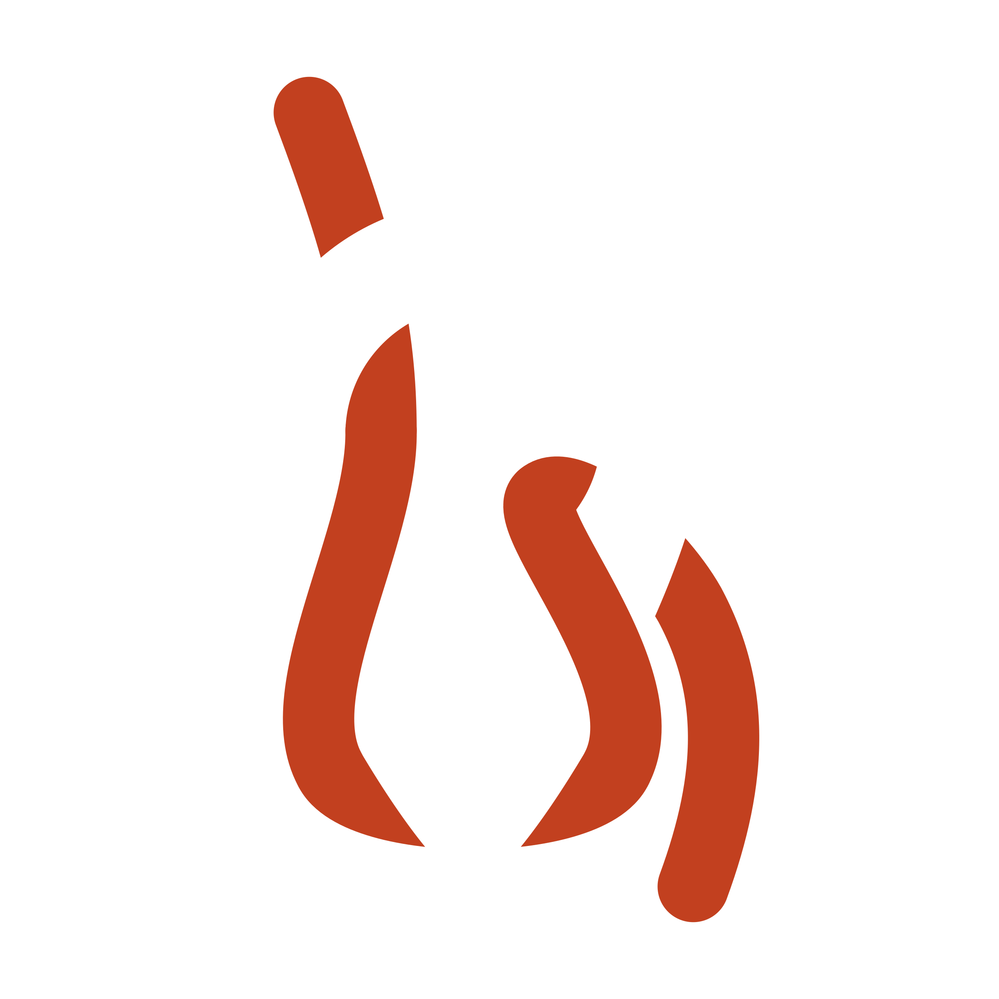
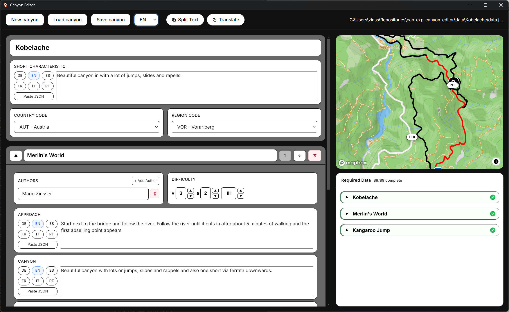

<p align="center">
  <span style="display:inline-flex;width:120px;height:120px;align-items:center;justify-content:center;background:#1f1f1f;border-radius:22px;">
    
  </span>
</p>

<h1 align="center">Canyon Explore - Canyon Editor</h1>

<p align="center">
  A desktop canyon editor to introduce and maintain new canyons for the Canyon Explore app.
</p>

<p align="center">
  <a href="https://canyon-explore.com/"><strong>Canyon Explore</strong></a>
</p>

<p align="center">
  
</p>

## Overview
With Canyon Editor, new canyons can be introduced for Canyon Explore in a structured way.  
Create routes with start, waypoint, and end points on the map, then export the canyon data for app integration.

## Why It Stands Out
- Built specifically for adding canyon content to Canyon Explore
- Fast, map-based editing of ordered route points
- Clean export format for integration into existing workflows
- Desktop app workflow for Windows and macOS

## Commands
Run in development
`npm run dev`

Build Windows portable executable
`npm run package:win`
`npm run package:dist`

Build macOS app directory artifact (compatible with macOS 10.15 Catalina and newer)
`npm run package:mac`
`npm run package:dist`

Build macOS ZIP artifact (Catalina compatible)
`npm run package:mac:zip`
`npm run package:dist`

Compatibility note:
- This project is pinned to Electron 32.x so the app can run on macOS 10.15.6.
- macOS packaging is forced to `x64` for Catalina support (`arm64` requires macOS 11+).

## Build macOS on GitHub Actions (from Windows)
GitHub workflow file:
`.github/workflows/build-macos.yml`

1. Commit and push your changes (including the workflow file) to GitHub.
2. In GitHub, open `Actions` -> `Build macOS Distribution`.
3. Click `Run workflow` and select your branch.
4. Wait until the run is green (workflow verifies `x86_64` arch and `LSMinimumSystemVersion=10.15.0`).
5. Download artifact `canyon-editor-macos`.

Artifact content:
- `canyon-editor-macos.tar.gz` (contains `macos/Canyon Editor.app`, `macos/assets/`, `macos/data/`)

On macOS, extract with:
```bash
tar -xzf canyon-editor-macos.tar.gz
```

If Gatekeeper blocks first launch:
```bash
xattr -dr com.apple.quarantine "macos/Canyon Editor.app"
```

Note:
- The artifact does not include your local `.env`.
- After downloading, create `assets/.env` and add:
```env
VITE_MAPBOX_TOKEN=your_mapbox_token_here
MAPBOX_TOKEN=your_mapbox_token_here
```
